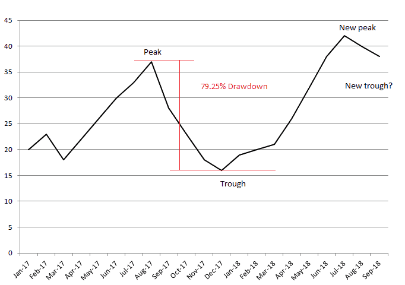
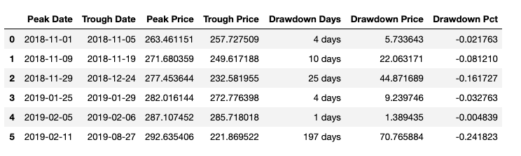
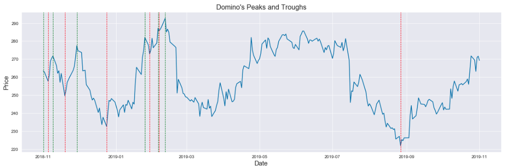

# Drawdowns in the Stock Market 
A drawdown is a measurement of a **peak-to-trough** decline for an investment such a trading account, ETF or the performance of a single stock over a specific period of time. Drawdowns are import for calculating the historical risk of different investments, comparing the performance of various funds or just monitoring the performance of your personal portfolio. 



Drawdowns are most commonly expressed in percentage form but can also be expressed in a monetary amount. 

## The Process 
I pulled one year of stock data via Yahoo Finance for Domino's Pizza (DPZ) from 11/1/2018 to 11/1/2019 using **pandas_datareader.web**. 

Please note that this method does not work on Pandas 0.25. If you are using the most recent version of Pandas and you want to pull stock data from Yahoo Finacnce using this method you will have to do the followng:
```python
pip install "pandas<0.25.0"
```

This method will return a Pandas dataframe with the date as the index, along with a column for the high, low, open and close prices for each day, as well as the volumne and adjusted close. For this particular analysis we only want need to focus on the adjusted close and the date so we'll use the following function:
```python
def PriceDate(stock_df):
    stock_df = stock_df.reset_index()
    stock_df['Price'] = stock_df['Adj Close']
    return stock_df[['Date', 'Price']]
 ```
 Once we have the data we need we can put this dataframe through the drawdown function that I wrote that is essentially the meat of the project and can be viewed in the Jupyter notebook in this repository. This function will return another dataframe containing columns for the Peak Date, Trough Date, Peak Price, Trough Price, number of Drawdown Days, Drawdown price and Drawdown percentage expressed in decimal format. 
 
 
 
Lastly I used Seaborn to visualize the results with the green dotted lines representing **Peak Days** and the red dotted lines representing **Trough Days**: 
 

 
Obviousy this graph isn't the easiest to read especially when peak and trough days are only apart by a day or so, but it can give you a general sense of the way a partiular stock behaves. For example you can observe that the most recent drawdown was 197 days with a trough price of $221.87. And even though the stock has been on a steady increase since the end of August 2019 its still has a ways to go before it hits another peak. 
